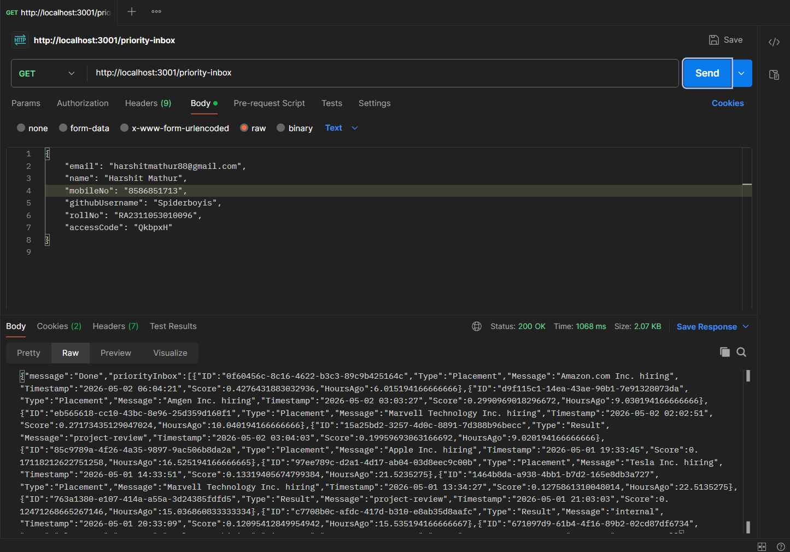
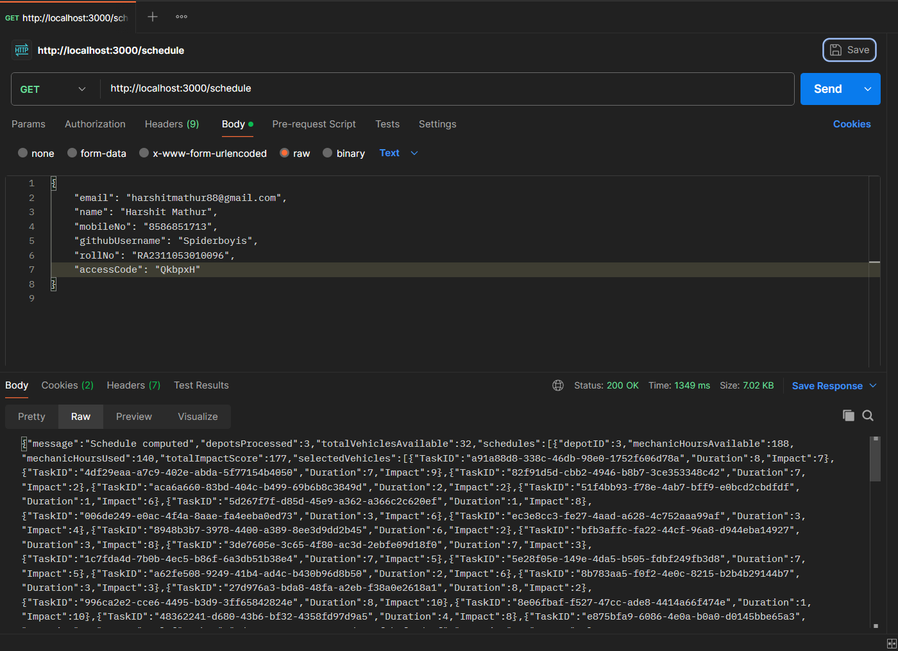

# Notification System Design

## What is this project?

So basically, this is a backend service that fetches notifications from an external API and then figures out which ones are the most important. Instead of showing all notifications at once, it picks the top ones based on their type and how recent they are. Think of it like how your email separates important stuff from everything else that's what this does.

The whole thing runs on Express.js (TypeScript) and talks to an external evaluation server to get notifications and handle authentication.

## How the project is structured

There are two main parts:

1. **notification_app_be** - this is the main backend server that does the actual work
2. **logging_middleware** - this is a small helper package that handles auth tokens and sends logs to the evaluation server

Inside `notification_app_be/src/`, there are 4 files:

- `index.ts` - sets up the Express server and the `/priority-inbox` route
- `api.ts` - handles fetching notifications from the external API
- `priorityInbox.ts` - has the scoring and sorting logic
- `types.ts` - just the TypeScript types/interfaces

Inside `logging_middleware/src/`, there are 4 files:

- `auth.ts` - gets and caches the auth token so we don't request a new one every time
- `logger.ts` - sends log entries to the evaluation server
- `types.ts` - types for auth, logs, etc.
- `index.ts` - exports the Log function

## How it works (step by step)

### Step 1 - User makes a request

Someone sends a GET request to `http://localhost:3001/priority-inbox`. You can also pass `?n=5` if you only want 5 results instead of the default 10.

### Step 2 - Get the auth token

Before we can fetch anything, we need a valid token. The `auth.ts` file in the logging middleware handles this. It sends our credentials (email, roll number, access code, etc.) to the evaluation server's `/auth` endpoint and gets back a token. It also caches the token so it doesn't keep requesting new ones every single time.

### Step 3 - Fetch all notifications

Once we have the token, `api.ts` calls the external API at `/evaluation-service/notifications` with the token in the Authorization header. This gives us back a big list of notifications. Each notification has an ID, a Type, a Message, and a Timestamp.

### Step 4 - Score each notification

This is where the main logic lives in `priorityInbox.ts`. Every notification gets a score based on two things:

**Type weight** - not all notifications are equal:
- Placement → weight 3 (most important)
- Result → weight 2
- Event → weight 1 (least important)

**How old it is** - newer notifications should show up first. We calculate how many hours ago the notification was posted and use this formula:

```
Score = weight × (1 / (1 + hoursAgo))
```

So a Placement notification from 1 hour ago would score higher than a Result notification from 10 hours ago. The idea is simple important + recent = top of the list.

### Step 5 - Sort and pick the top N

After scoring everything, we sort the list from highest score to lowest using a basic bubble sort. Then we just grab the top N notifications (default is 10) and send them back as the response.

### Step 6 - Return the response

The server sends back a JSON response with the message "Done" and the `priorityInbox` array containing the top scored notifications. Each notification in the response includes the original fields plus the calculated Score and HoursAgo.

## Logging

Throughout the whole flow, we log what's happening using the logging middleware. Every major step (request received, fetching notifications, scoring done, errors) gets logged to the evaluation server. This helps with debugging and also satisfies the evaluation requirements.

The `Log` function takes 4 parameters: stack (backend/frontend), level (info/error/etc.), package name, and a message.

## Testing it with Postman

Here's what the priority inbox response looks like when tested with Postman:



You can see the request body has our credentials, and the response shows a list of scored notifications sorted by priority. Each notification has the Type, Message, Score, and HoursAgo fields.

And here's the schedule endpoint for reference:



## Tech used

- **Runtime**: Node.js with TypeScript
- **Framework**: Express.js
- **HTTP client**: Axios (for calling external APIs)
- **Port**: 3001
- **External API**: Evaluation server at `20.207.122.201`

## Quick summary

User hits the API → we authenticate → fetch all notifications → score them based on type and freshness → sort by score → return the top ones. That's pretty much it.
